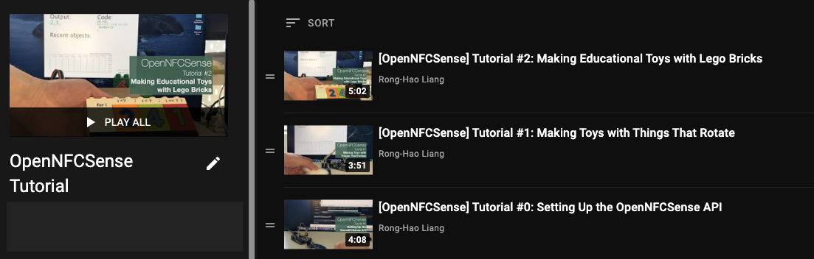

# OpenNFCSense API
Open-source API of NFCSense for the Processing programming environment (http://processing.org/). Please refer to the following workflow to start experiencing the NFCSense!

by [Dr. Rong-Hao Liang](https://ronghaoliang.page) (Last update: May 26, 2021)

_Now it's **V2: Basic Tutorial and Examples** are available!_

[](docs/NFCSenseCheatSheet_v1.png)

## NFCSense Project website: 
- [https://ronghaoliang.page/NFCSense/](https://ronghaoliang.page/NFCSense/)

### Check the Open Access Paper at ACM Digital Library: 
- [HTML](https://dl.acm.org/doi/fullHtml/10.1145/3411764.3445214)
- [PDF](https://dl.acm.org/doi/pdf/10.1145/3411764.3445214)

## NFCSense Video Tutorials
[](https://youtube.com/playlist?list=PLSgbdfV4TB2f16s4GMy_-1ZMu_zGP9QIH)
[Episode 2: Making Educational Toys with Lego Bricks](https://youtu.be/lkaZDMGdLuQ)
[Episode 1: Making Toys with Things That Rotate](https://youtu.be/jzElM6CWH4s)
[Episode 0: Setting Up the OpenNFCSense API](https://youtu.be/Gal2keOJShM)
### All the examples shown in the videos are in the /examples folder

## Prerequisite (for V2)
- 1x Arduino Uno board
- 1x RC522 NFC reader
- A few NFC tags (e.g., Mifare 1k, NTAG213, NTAG215)
- A computer installed Processing and Arduino IDEs

## Download (/download)
The OpenNFCSense API V2 of the Processing Library (OpenNFCSense4P-2.zip) in zip format.

### Install the processing library - OpenNFCSense API 
[Episode 0: Setting Up the OpenNFCSense API](https://youtu.be/Gal2keOJShM)
Unzip and put the extracted OpenNFCSense folder into the libraries folder of your Processing sketches. Reference and examples are included in the OpenNFCSense folder. Then, Restart your Processing software. New examples can be found in the processing library.

## Preparation: Upload the Arduino code (/arduino) and Connect the Reader
[Episode 0: Setting Up the OpenNFCSense API](https://youtu.be/Gal2keOJShM)
- Upload the arduino code to your Arduino board first! This software works with a microcontroller connected to an RC522 NFC/RFID Reader and run the Arduino code: NFCSense4P_ArduinoUno_RC522_v1.ino.
- Connect the RC522 NFC reader to the Arduino board as follows (via the Arduino's SPI)


## Use the OpenNFCSense API by Examples
### e1_SingleTagRotation
[Episode 1: Making Toys with Things That Rotate](https://youtu.be/jzElM6CWH4s)
[Episode 2: Making Educational Toys with Lego Bricks](https://youtu.be/lkaZDMGdLuQ)
- Open the example e1_SingleTagRotation.pde
- Attach an NFC tag to anything that spins, such as a fidget spinner.
- Run the processing sketch, scan the tag, and keep the tag's 4-byte Universal ID (UID0,UID1,UID2,UID3) shown in the console. Close the processing sketch.
- Open the data/tagProfile.csv in the examples' folder, replace the UID of "Black spinner" with yours, save the CSV file.
- Run the processing sketch again, spin the your spinner, and then you will see the object info and the rotation frequecy shown on the screen as "Recent tag: [Label] is spinning at ? Hz".
- In the data/tagProfile.csv, You may replace the "Black spinner" label to any name (avoid using comma). You can make another row with the same format to be able to recognize multiple spinners!

### e2_SingleTagSwinging
- Open the example e2_SingleTagSwinging.pde
- Attach an NFC tag to anything that swings, such as a finger.
- Run the processing sketch, scan the tag, and keep the tag's 4-byte Universal ID (UID0,UID1,UID2,UID3) shown in the console. Close the processing sketch.
- Open the data/tagProfile.csv in the examples' folder, replace the UID of "Swing" with yours, save the CSV file.
- Run the processing sketch again, spin the your spinner, and then you will see the object info and the rotation frequecy shown on the screen as "Recent tag: [Label] is swining at ? Hz".
- In the data/tagProfile.csv, You may replace the "Swing" label to any name (avoid using comma). You can make another row with the same format to be able to recognize swinging objects!

### e3_TagSequence
- Open the example e3_TagSequence.pde
- Attach an NFC tag to the bottom of any objects, such as a duplo block that has a letter printed on its surface. Maintain z=8-25mm (for Mifare 1k or NTAG 213/215 tags) distance between the tag and the reader with an optional linear track for reliable tracking.
- Run the processing sketch, scan the tag, and keep the tag's 4-byte Universal ID (UID0,UID1,UID2,UID3) shown in the console. Then, close the processing sketch.
- Open the data/tagProfile.csv in the examples' folder, replace the UID with yours, save the CSV file.
- Run the processing sketch again, scan your object, and then you will see object shown in list of a recent tag.
- In the data/tagProfile.csv, You may replace the "A" label to any name (avoid using comma). Likewise, you add the 2nd, 3rd, and more object's UIDs and label to the CSV profile. Save the profile and run the processing sketch again, and your reader should be able to read all of them.
- The list of "recent tag" will be cleared up when the reader does not read a new tag for 1000 ms (1 s) by default. You may change it to 2 seconds by setting up a parameter to the constructor as `nfcs = new OpenNFCSense4P(this, "demo.csv", 300, 300, 2000)` to set the TTL timer2 to 2000.

### e4_CompoundRotation
- Open the example e4_TagSequence.pde
- Attach __3__ NFC tags to anything that spins, such as a fidget spinner. Don't let the tags overlap.
- Run the processing sketch, scan one of the tag, and keep the first tag's 4-byte Universal ID (UID0,UID1,UID2,UID3) shown in the console. Then, rotate the object counterclockwisely and get the second tag's 4-byte UID. Then rotate the object counterclockwisely and get the third tag's 4-byte UID. close the processing sketch.
- Open the data/tagProfile.csv in the examples' folder, replace the UID of the three "white spinner" tags with yours. The first tag goes first, and then the second and the third. Save the CSV file after it's done.
- Run the processing sketch again, spin the object, and then you will see the object's info, the rotation direction and frequecy shown on the screen as "Recent tag: [Label] is spinning \n (counter)clockwise at ? Hz". In recent tags you also see the sequence of the tag presence.
- In the data/tagProfile.csv, You may replace the "White spinner" label to any name (avoid using comma). Likewise, you add more object's UIDs and label to the CSV profile. Save the profile and run the processing sketch again, and your reader should be able to read all of them.

### e5_CompoundLinear
- Open the example e5_CompoundLinear.pde
- Attach __2__ NFC tags to anything that moves linearly, such as a trolley. Don't let the tags overlap. Maintain z=8-25mm (for Mifare 1k or NTAG 213/215 tags) distance between the tag and the reader with a linear track for reliable tracking.
- Run the processing sketch, scan one of the tag, and keep the first tag's 4-byte Universal ID (UID0,UID1,UID2,UID3) shown in the console. Then, scan the second tag and get its 4-byte UID. Close the processing sketch.
- Open the data/tagProfile.csv in the examples' folder, replace the UID of the two "trolley" tags with yours. The first tag goes first, and then the second. Replace the number 34.0 of the both tag with the actual distance between the center of the two tags (e.g., set 38.0 when the distance is 38mm). Save the CSV file after it's done.
- Run the processing sketch again, move the object linearly, and then you will see the object's info, the movement direction and speed shown on the screen as "Recent tag: [Label] is moving \n forward/backward at ? km/h". In recent tags you also see the sequence of the tag presence.
- In the data/tagProfile.csv, You may replace the "Trollety" label to any name (avoid using comma). Likewise, you add more object's UIDs and label to the CSV profile. Save the profile and run the processing sketch again, and your reader should be able to read all of them.

### e6_SingleTagHovering
- Open the example e6_SingleTagHovering.pde
- Attach __1__ NFC tags to the top of anything that moves linearly, such as a boat. Maintain z = 7-25 mm (for Mifare 1k or NTAG 213/215 tags) distance between the tag and the reader with a linear track for reliable tracking.
- Run the processing sketch, scan the tag, and keep the tag's 4-byte Universal ID (UID0,UID1,UID2,UID3) shown in the console. Close the processing sketch.
- Open the data/tagProfile.csv in the examples' folder, replace the UID of the "boat" tags with yours. Save the CSV file after it's done.
- Run the processing sketch again, move the object linearly, and then you will see the object's info, the movement direction and speed shown on the screen as "Recent tag: [Label] is sliding at ? km/h". **Note: This speed is not correct yet.** We measure the tag activation path length using a ruler. By checking the moving bar on the screen, we can get the reader of the path activation length as X mm.
- In the data/tagProfile.csv, replace the L1 from 43.0 to the X that you measured (e.g., 39.0 when X = 39mm). You may replace the "Boat" label to any name (avoid using comma). Save the profile and run the processing sketch again, and **your reader will be able to read the correct speed** of the tag movement.
- Likewise, you can add more object's UIDs, label, and L1 to the CSV profile. 

### e7_SingleTagSlidingHovering
- Open the example e7_SingleTagSlidingHovering.pde
- Attach __1__ NFC tags to the bottom of anything that moves linearly, such as a figurine. Maintain less than 6mm distance (for Mifare 1k or NTAG 213/215 tags) between the tag and the reader with a linear track.
- Run the processing sketch, scan the tag, and keep the tag's 4-byte Universal ID (UID0,UID1,UID2,UID3) shown in the console. Close the processing sketch.
- Open the data/tagProfile.csv in the examples' folder, replace the UID of the "figurine" tags with yours. Save the CSV file after it's done.
- Run the processing sketch again, move the object linearly, and then you will see the object's info, the movement direction and speed shown on the screen as "Recent tag: [Label] is sliding at ? km/h". **Note: This speed is not correct yet.** We need to measure the tag activation path lengths with a ruler. 
- Two tag activation path lengths have to be measured: 1) L1 for Sliding, and 2) L2 for Hovering. For L1 (sliding), since there will be 3 segments of activation that are observable, check the longest one on the screen so that you can get the L1 = X mm. For L2 (hovering), put a spacer below the tag to make the z>6mm. There will be only one segment of activation that is observable so that you can get L2 = Y mm.
- In the data/tagProfile.csv, replace the L1 from 39.0 to the X that you measured and the L2 from 43.0 to the Y that you measured. You may replace the "Figurine" label to any name (avoid using comma). Save the profile and run the processing sketch again, and **your reader will be able to read the correct speed** of the tag movement in the both modes. The hovering speed can be less accurate if the object is above z=25mm.
- Likewise, you can add more object's UIDs, label, L1 and L2 to the CSV profile. 

### e8_SingleTiltedTagSliding
- Open the example e8_SingleTiltedTagSliding.pde
- Attach __1__ tilted (between 60-75 degree) NFC tags to the bottom of anything that moves linearly, such as a car. Maintain less than 22mm distance (for Mifare 1k or NTAG 213/215 tags) between the tag's center and the reader with a linear track.
- Run the processing sketch, scan the tag, and keep the tag's 4-byte Universal ID (UID0,UID1,UID2,UID3) shown in the console. Close the processing sketch.
- Open the data/tagProfile.csv in the examples' folder, replace the UID of the "Car" tags with yours. Save the CSV file after it's done.
- Run the processing sketch again, move the object linearly, and then you will see the object's info, the movement direction and speed shown on the screen as "Recent tag: [Label] is sliding forward/backward at ? km/h". **Note: This speed is not correct yet.** We need to measure the tag activation path lengths with a ruler. 
- Since there will be 2 segments of activation that are observable, check the longest one on the screen so that you can get the L1 = X mm.
- In the data/tagProfile.csv, replace the L1 from 31.0 to the X that you measured. You may replace the "Car" label to any name (avoid using comma). Save the profile and run the processing sketch again, and **your reader will be able to read the correct speed** of the tag movement in both directions.
- Likewise, you can add more object's UIDs, label, L1 to the CSV profile. 

### e9_Demo
- Open the example e9_Demo.pde
- Copy the lines that you just created from the tagProfile.csv files in the previous examples to the demo.csv.
- Run the processing sketch, then every object's movement mode and it's correct speed can be detected.

### e0_App_Boilerplate
- Open the example e0_App_Boilerplate.pde
- Copy the lines that you just created from the tagProfile.csv or demo.csv files in the previous examples to the demo.csv.
- Now you can use this processing sketch as a boilerplate to create your own applications.

## Cheatsheet (/docs)
The 1-page Summary of how the proposed algorithm works.

### Documentation
The full documentation will be available soon!

## Source (/src)
The source code of the OpenNFCSense library (**GNU GPLv3 copyleft license**)

## Cite this Work: 

If you use this library, please cite the original NFCSense paper as following

- ACM format:
```
Rong-Hao Liang and Zengrong Guo. 2021. NFCSense: Data-Defined Rich-ID Motion Sensing for Fluent Tangible Interaction Using a Commodity NFC Reader. In <i>Proceedings of the 2021 CHI Conference on Human Factors in Computing Systems</i> (<i>CHI '21</i>). Association for Computing Machinery, New York, NY, USA, Article 505, 1–14. DOI:https://doi.org/10.1145/3411764.3445214
```
- bibtex format:
```
@inproceedings{10.1145/3411764.3445214,
author = {Liang, Rong-Hao and Guo, Zengrong},
title = {NFCSense: Data-Defined Rich-ID Motion Sensing for Fluent Tangible Interaction Using a Commodity NFC Reader},
year = {2021},
isbn = {9781450380966},
publisher = {Association for Computing Machinery},
address = {New York, NY, USA},
url = {https://doi.org/10.1145/3411764.3445214},
doi = {10.1145/3411764.3445214},
abstract = { This paper presents NFCSense, a data-defined rich-ID motion sensing technique for fluent tangible interaction design by using commodity near-field communication (NFC) tags and a single NFC tag reader. An NFC reader can reliably recognize the presence of an NFC tag at a high read rate (∼ 300 reads/s) with low latency, but such high-speed reading has rarely been exploited because the reader may not effectively resolve collisions of multiple tags. Therefore, its human–computer interface applications have been typically limited to a discrete, hands-on interaction style using one tag at a time. In this work, we realized fluent, hands-off, and multi-tag tangible interactions by leveraging gravity and anti-collision physical constraints, which support effortless user input and maximize throughput. Furthermore, our system provides hot-swappable interactivity that enables smooth transitions throughout extended use. Based on the design parameters explored through a series of studies, we present a design space with proof-of-concept implementations in various applications. },
booktitle = {Proceedings of the 2021 CHI Conference on Human Factors in Computing Systems},
articleno = {505},
numpages = {14},
keywords = {Tags, Rich-ID, Motion Sensing, Fluent, Tangible Interaction, Physical Constraints, NFC},
location = {Yokohama, Japan},
series = {CHI '21}
}
```

## License (GNU GPLv3 copyleft license)
OpenNFCSense is an open-source software under the terms of **GNU GPLv3 copyleft license**. Anyone can use this, for any purpose. Since a **copyleft** license requires that the project developed around your software be distributed under the same (or similar) license, you must give all users of your work the freedom to carry out all of copying, distribution and modification activities if the work is based on OpenNFCSense.

We also offer closed-source license which give you the ability not redistribute your software as open-source too. Contact the authors via (r.liang@tue.nl) if you are interested.

In any form of copying, distribution and modification, you must include the following description in your source code, as mentioned in https://www.gnu.org/licenses/

```
/*========================================================================== 
//  OpenNFCSense4P (v1) - Open NFCSense API for Processing Language
//  Copyright (C) 2021 Dr. Rong-Hao Liang
//    This program is free software: you can redistribute it and/or modify
//    it under the terms of the GNU General Public License as published by
//    the Free Software Foundation, either version 3 of the License, or
//    (at your option) any later version.
//
//    This program is distributed in the hope that it will be useful,
//    but WITHOUT ANY WARRANTY; without even the implied warranty of
//    MERCHANTABILITY or FITNESS FOR A PARTICULAR PURPOSE.  See the
//    GNU General Public License for more details.
//
//    You should have received a copy of the GNU General Public License
//    along with this program.  If not, see <https://www.gnu.org/licenses/>.
//==========================================================================*/
```

